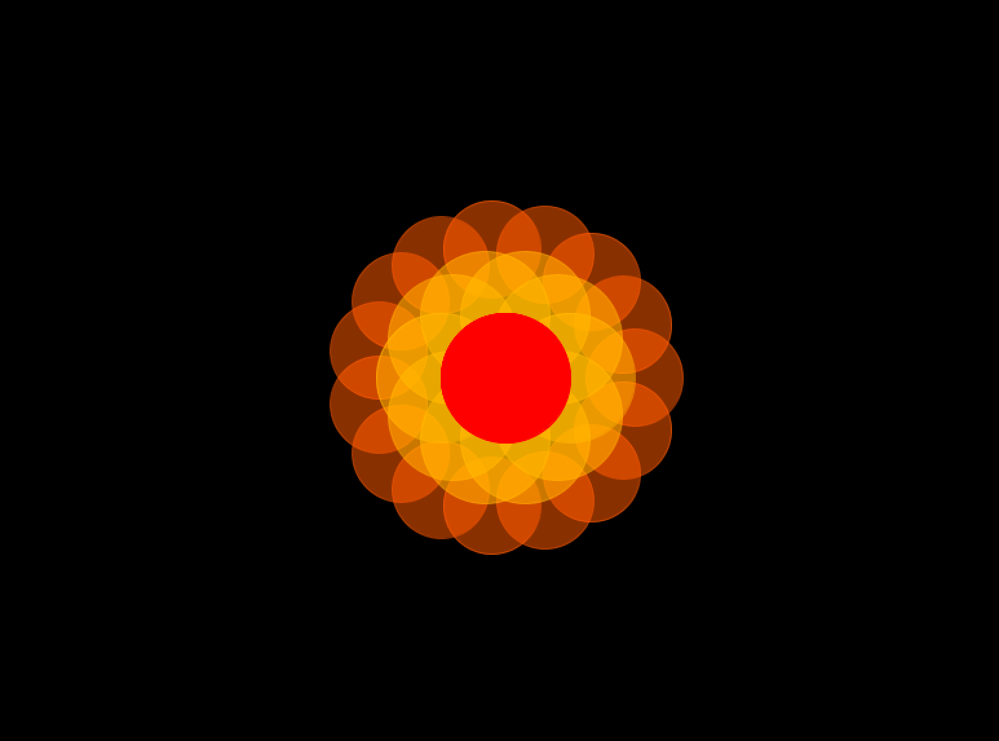

In this repo we will work with [processing](https://processing.org/) and [arduino](https://www.arduino.cc/). Both environment have made it possible over the years for designers and artists to produce [rich interactive experiences and artworks](https://processing.org/exhibition/) both in the field of multimedia programming (processing) and electronics (arduino).

# Arduino

Your main ressource about arduino will be located [here](https://github.com/b2renger/Introduction_arduino#contenu), it's in french, but having the code and the schematics of the circuits should be enough for most usages. This introduction covers some sensors and actuators but far from everything that is possible to do with arduino. One interesting part for us will be the part explaining communication between processing and arduino via **Serial** (Universal Serial Bus i.e. USB). Right at the end, three examples will explain to you [how to control the playback of video with a distance sensor](https://github.com/b2renger/Introduction_arduino#controler-le-playback-dune-vid%C3%A9o-avec-un-capteur-de-distance), [how to control an animation with a photoresistance](https://github.com/b2renger/Introduction_arduino#controler-une-animation-avec-une-photoresistance) and finally the other way around [how to send mouse coordinates to arduino to light up a RGB led strip](https://github.com/b2renger/Introduction_arduino#controler-des-leds-neopixels-avec-la-souris) - this one is a little bit harder. But we will get back to this later on.

First you should spend some time with arduino, discover the examples : build the circuit, upload the code and try to make things move / sense.

Next we will take a deeper look at processing.


# Processing - drawing a flower

*Processing seeks to ruin the careers of talented designers by tempting them away from their usual tools and into the world of programming and computation. Similarly, the project is designed to turn engineers and computer scientists to less gainful employment as artists and designers.*

Appart from this processing is an amazing middleware to make things communicate, sketch simple things through code etc.


## Getting started

This [first link](https://processing.org/tutorials/gettingstarted/) should get you started with processing. You'll get the basics of the interface a write your first sketch : an ellipse following the mouse !

This [second link](https://processing.org/tutorials/drawing/) will give you a little more insights about the coordinate system of processing and the difference kind of shapes you can draw.


## The flower project

So let's get started on our flower project ! In this project we will get used to the processing environment and draw some shapes. We will use the HSB color mode and polar coordinate system to draw some flowers, then we will see how to parametrize those and animate them using data coming from an arduino card.

### Our first flower

#### A simple circle

First we will need to draw the center : a simple circle will do.


```java
void setup() {
  size(800, 600);
  background(0);
  colorMode(HSB, 360, 100, 100, 100);
}

void draw() {
  background(0);
  pushMatrix();
  translate(width*0.5, height*0.5);
             
  fill(0, 100, 100, 100);
  stroke (0, 100, 100, 100);
  strokeWeight(1);
  ellipse(0, 0, 100, 100);
  popMatrix();
}
```

The **setup()** function is run only once at the start of our program (when we click play) it is used to initialize things for our program. Here we :

- set the [**size**](https://processing.org/reference/size_.html) of our drawing window.

- set the [background](https://processing.org/reference/background_.html) to black.

- set the [colorMode](https://processing.org/reference/colorMode_.html) of our sketch to HSB (Hue Saturation Brightness). 
This will impact every call we make to [fill()](https://processing.org/reference/fill_.html) or [stroke()](https://processing.org/reference/stroke_.html) since the four paramater we will have to pass will be the  hue (between 0 and 360), saturation (between 0 = no saturation and 100 = full colors) and brightness (0 = black and 100 = full brightness), opacity will be an optional fourth paramater (between 0 = full transparent and 100 = opacity to the max.)

The **draw()** function will be called repeatidly once the program is running we will use it to draw and program interactivity with our drawings.

Again we set the background to black thus erasing previous things that were drawn.

Then we use [**pushMatrix()**](https://processing.org/reference/pushMatrix_.html) coupled with a [**popMatrix()](https://processing.org/reference/popMatrix_.html) - at the end of the draw function.

To understand a little further the way transformation of the space work in processing you can [check this example out](https://www.openprocessing.org/sketch/388513) :
In black is the original processing coordinate system. 
In red is the coordinate system after having called :
```java
translate(mouseX, mouseY);
```
In blue is the coordinate system after having called :
```
translate(mouseX, mouseY);
rotate(PI/5);
```

So we just use this in combination with
```
translate(width*0.5, height*0.5);
````
to place us at the center of our drawing window. 

After that we can prepare to start drawing by specifying the fill and stroke of our future drawing (remember you always need to choose your pen before you start drawing !). And finally comes our [ellipse()](https://processing.org/reference/ellipse_.html). We will draw it at (0,0) since we translated our coordonate system to the center of the window and its diameter will be 100 pixels.

#### A for() loop for the petals

Now we need to draw some petals : it will be a little more tricky as we will use a [for()](https://processing.org/reference/for.html) loop.

As you have read in the documentation a for loop is used to make iteration. For instance if you want to draw a 100 circles, you'll use a for loop executing some code a hundred times.

For instance :

```java
void setup(){
    size(800, 600);
    background(0);
    colorMode(HSB, 360, 100, 100, 100);
}

void draw(){
    background(0);
    
    for (int i = 0 ; i < 99 ; i++){
        stroke(random(360), 100, 100, 90);
        float radius = random(25, 100);
        ellipse(random(width), random(height), radius, radius );
    
    }
    noLoop();    
}
```

Now what we want to do here is to draw let's say 10 circles, which center will be placed on the edge of our previous circle.

We will use [polar coordinates](https://en.wikipedia.org/wiki/Polar_coordinate_system). It's just a fancy way of placing objects in space using a angle and a distance instead of using x and y coordinates.

It will be easier for us since what we want to do is actually place 10 circles on the edge of our center circle : then our distance will be always the same ie **100*0.5** the radius of our center circle. And we will want to use angles that varies from 0 to 2*PI at the step of **2*PI/10** as we want to achieve a full revolution and we want our circle to be even spaced.

Once we figured this out we just need to apply a formula to transform our polar coordinates into cartesian coordinates that we can draw with processing.

```
x = centerX + distance * cos(angle);
y = centerY + distance * sin(angle);
```

```java
void setup() {
  size(800, 600);
  background(0);
  colorMode(HSB, 360, 100, 100, 100);
}

void draw() {
  background(0);

  pushMatrix();
  pushStyle();
  translate(width*0.5, height*0.5);

 
  for (int i = 0; i < 10; i++) {
    fill(45, 100, 100, 50);
    stroke (45, 100, 100, 50);
    strokeWeight(1);
    // the formula is here : https://www.openprocessing.org/sketch/151087
    float x = 0 + cos(i*(TWO_PI)/10)*100/2;
    float y = 0 + sin(i*(TWO_PI)/10)*100/2;
    float rad = 100;
    ellipse(x, y, rad, rad);
  }
 
  fill(0, 100, 100, 100);
  stroke (0, 100, 100, 100);
  strokeWeight(1);
  ellipse(0, 0, 100, 100);

  popStyle();
  popMatrix();
}
```

Now you can probably draw a second corolla of petals again on the edge of the last corolla :

```java
void setup() {
  size(800, 600);
  background(0);
  colorMode(HSB, 360, 100, 100, 100);
}

void draw() {
  background(0);

  pushMatrix();
  pushStyle();
  translate(width*0.5, height*0.5);

  
  for (int i = 0; i < 15; i++) {
    fill(25, 100, 100, 50);
    stroke (25, 100, 100, 50);
    strokeWeight(1);

    float x = cos(i*(TWO_PI )/15)*100;
    float y = sin(i*(TWO_PI)/15)*100;
    float rad = 75;
    ellipse(x, y, rad, rad);
  }
 
  for (int i = 0; i < 10; i++) {
    fill(45, 100, 100, 50);
    stroke (45, 100, 100, 50);
    strokeWeight(1);

    float x = cos(i*(TWO_PI)/10)*100/2;
    float y = sin(i*(TWO_PI)/10)*100/2;
    float rad = 100;
    ellipse(x, y, rad, rad);
  }
 
  fill(0, 100, 100, 100);
  stroke (0, 100, 100, 100);
  strokeWeight(1);
  ellipse(0, 0, 100, 100);

  popStyle();
  popMatrix();
}

```

Once it is done you will find yourself with a beautifull flower like this one :


    
You will find the code for this first sketch in the folder "sketch_01_first_flower".

    
### Let's use a variable to parametrize our flower and make it bloom !

To make our flower bloom we will need to create a **variable**. A variable is a space in our computer's memory where we store something alongside with a name (of your choosing) to enable easy access to this value either to read it or to modify it.

We can store many things in the memory defined by their type :
- **float** to store a decimal number
- **int** to store integers numbers.
- **String** to store some text
- **boolean** to store a 0 or 1 which is equivalent to *false* or *true*.

Here we will want to define a float that will be used to define the size of the center of our flower.

```java
float centerSize = 50;
```

One important notion is the **scope** of the variable. The scope is the chunck of code in which the variable exists : the scope of any variable is limited to the opening curly bracket **{** preceeding it and the closing curly bracket **}** following it. If you create a variable before the setup() it will be available all over the program. If you create in the setup it will only exist in the setup; if you create one in a if statement it will only exist in this precise if statement etc.

So we will want to create a global variable : available in our whole program ie before the setup.

Now we will use it ! This variable will impact the size of the ellipse we are drawing

```java
ellipse(0, 0, centerSize, centerSize);
```

But also how we calculate the positions of the petals of our corollas.

```java
for (int i = 0; i < 10; i++) {
    fill(45, 100, 100, 50);
    stroke (45, 100, 100, 50);
    strokeWeight(1);

    float x = cos(i*(TWO_PI)/10)*centerSize/2;
    float y = sin(i*(TWO_PI)/10)*centerSize/2;
    float rad = 100;
    ellipse(x, y, rad, rad);
}
```

Here is the full code with the centerSize variable used :

```java
float centerSize = 50;

void setup() {
  size(800, 600);
  background(0);
  colorMode(HSB, 360, 100, 100, 100);
}

void draw() {
  background(0);

  pushMatrix();
  pushStyle();
  translate(width*0.5, height*0.5);
  
  for (int i = 0; i < 15; i++) {
    fill(25, 100, 100, 50);
    stroke (25, 100, 100, 50);
    strokeWeight(1);

    float x = cos(i*(TWO_PI )/15)*centerSize;
    float y = sin(i*(TWO_PI)/15)*centerSize;
    float rad = 75;
    ellipse(x, y, rad, rad);
  }
 
  for (int i = 0; i < 10; i++) {
    fill(45, 100, 100, 50);
    stroke (45, 100, 100, 50);
    strokeWeight(1);

    float x = cos(i*(TWO_PI)/10)*centerSize/2;
    float y = sin(i*(TWO_PI)/10)*centerSize/2;
    float rad = 100;
    ellipse(x, y, rad, rad);
  }
 
  fill(0, 100, 100, 100);
  stroke (0, 100, 100, 100);
  strokeWeight(1);
  ellipse(0, 0, centerSize, centerSize);

  popStyle();
  popMatrix();
}
```

Now to make this more interactive we will enable our user to change the centerSize variable with their mouse. For this we will need to [**map()**](https://processing.org/reference/map_.html) the position of our mouse to values that could be used as our centerSize variable.

```java
centerSize = map(mouseX, 0, width, 0, 150);
```
This line of code will be written in the draw() function as we want to calculate a new size for our center each time the user moves the mouse. If the mouse position is on the far left of the screen our centerSize variable will be 0, if it's on the far right centerSize will be 150 thus making the flower bloom when the user move the mouse from left to right.

You will find the code for this first sketch in the folder "sketch_02_blooming_flower".

Next step will be to make it bloom with some data coming from arduino !


## More ressources on Processing

- the official reference of the language : https://processing.org/reference/

- official tutorials : https://processing.org/tutorials/

- fun programming videos : https://funprogramming.org/


# Processing + arduino == fun !

## Make our flower bloom with data from a sensor

To do this we will need to make a little bit of arduino.

First you will need to make one of those two circuits and flash your arduino card with the appropriate code.

- either use a [potentiometer](https://github.com/b2renger/Introduction_arduino#potentiom%C3%A8tre)
- or a [photoresistance](https://github.com/b2renger/Introduction_arduino#photo-r%C3%A9sistance)
- or a [microphone](https://github.com/b2renger/Introduction_arduino#micro)
    
Now that we have done this we need to write some arduino code to post the value on our **Serial** port. For this we will format our data to the [JSON](https://fr.wikipedia.org/wiki/JavaScript_Object_Notation) format. 

Our JSON string will look something like this :

```js
{
    "value" : value-read-from-our-sensor
}
```

This little bit of code will help you to build the string with json formatting (if your sensor is plugged in on analog 0 :

```c
String json;
  json = "{\"valeur1\":";
  json = json + analogRead(0);
  json = json + "}";
```

Now we just need to post this thing on the serial port : 

```c
void setup() {
  Serial.begin(9600); //open the serial port
}

void loop() {
  
  int value = analogRead(0); // read the value on analog 0
  
  // format a string to a json format and add our value read from A0
  String json;
  json = "{\"valeur1\":";
  json = json + value;
  json = json + "}";
             
  // post the string on the serial port
  Serial.println(json);
}
```

You will find the code for this arduino program in the folder "sketch_03_a_arduino_read_and_post"

On the processing side of things we will want to read the data posted on the usb cable. For this we need to use a library : the [serial library](https://processing.org/reference/libraries/serial/index.html).

So right at the top of our previous sketch we will import the lib :

```java
import processing.serial.*;
````

And just below this we will create a new variable of the type **Serial** to create a connection for now we just create it and will initialize it in the setup.

```java
Serial myPort;
```

Since we are here we will also create a variable to store the value coming from the arduino.

```java
int valueFromArduino = 0;
```

Then in the setup, we will initialize our connection :

```java
printArray(Serial.list()); // print the list of devices connected via usb
String portName = Serial.list()[3]; // my arduino card is the third one on the list, check yours !
myPort = new Serial(this, portName, 9600); // open up the communication
myPort.bufferUntil('\n'); // mandatory for now

```

The we will need to get the data when it is sent by our arduino card. The serial lib gives a function for that : we can write code in it, and it will automatically get executed when the arduino sends something. This need to be written oustide setup or draw.

```java
void serialEvent (Serial myPort) {
  
}
```
Now this gets complicated but you can just copy/paste this code for now. You don't need to understand everything, but just to get what you need to modify to make what you actually want

```java
void serialEvent (Serial myPort) {
  try { // we try to do something but do not worry if it doesn't work !
    while (myPort.available() > 0) {
      String inBuffer = myPort.readStringUntil('\n'); // read the data received
      if (inBuffer != null) { // if it's not empty
        if (inBuffer.substring(0, 1).equals("{")) { // and if it looks like json
          JSONObject json = parseJSONObject(inBuffer); // we try to read it as json 
                                                   
          // Now you need to understand !!
          if (json == null) { // if it's no json we just don't do anything
          }
          else { //if it is json we get the data
            
              valueFromArduino    = json.getInt("valeur1");
             
            }
          }
        // we just need to close every curly bracket we opened ^^
        } 
        else {
        }
      }
    }
  } 
  catch (Exception e) {
  }
}
```

Now in the draw we can just map the value received to something usable as our centerSize int the draw

```java
centerSize = map(valueFromArduino, 0, 1023, 0, 150);
```
You will find the code for this sketch in the folder "sketch_03_b_processing_read_from_serial_and_bloom"

## Read data from sensors and log them on our computer.

Now we will look how to get data from arduino and log it into a file on our computer : a bit less fun but pretty usefull.

You will find the code for this program in the folder "sketch_04_Data_logging", it includes :
- a arduino program reading from two sensors and posting on the serial port
- a processing program reading the values and writing them on a file on the hard drive.

You have to try to make this work with two sensors of your choice, and then add a third one by modifying both programs.


# Digging a little deeper with Processing

## Genetic flower

### Genome

### Parent1 and Parent2 get a child

### Mutations

### A population of flowers

## Other bio inspired examples

- Examples from nature of code
- Examples from Genrative design (noise fields etc.)
- Custom examples